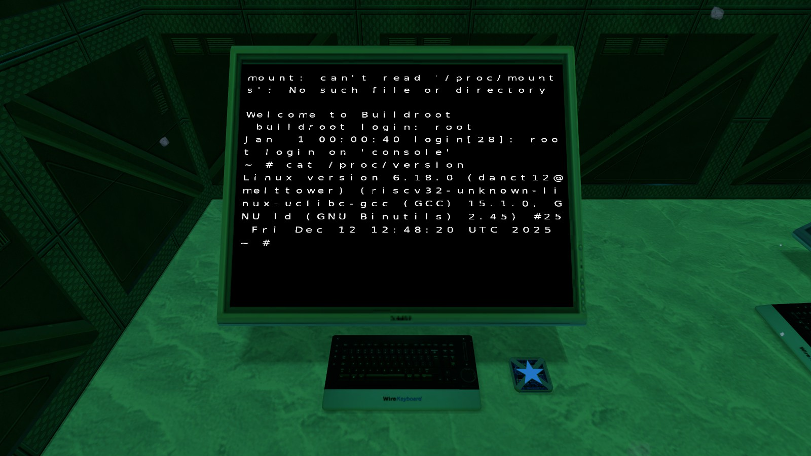
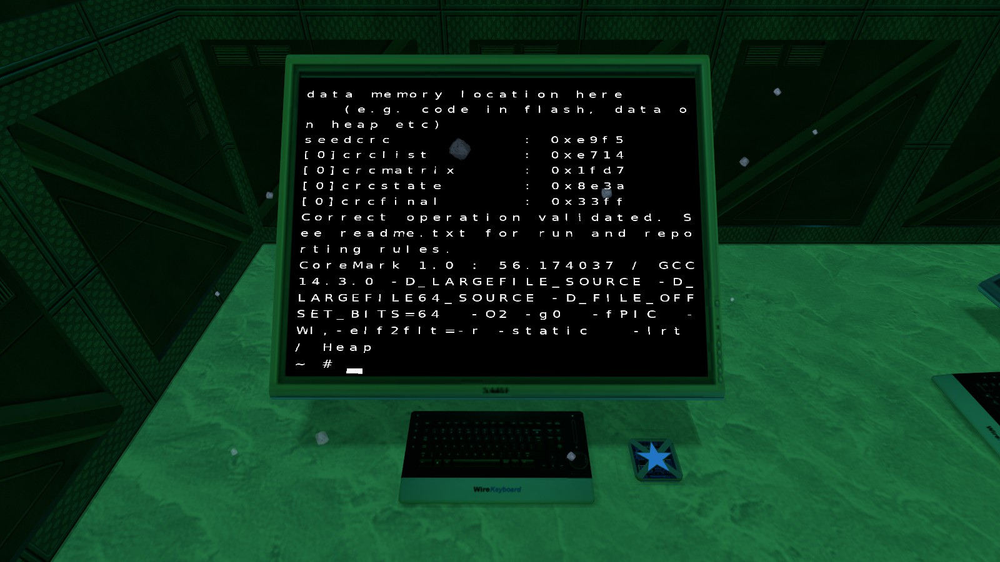

# riscv-starfall (mini-rv32ima-lua)

# Summary
This is a port of [mini-rv32ima](https://github.com/cnlohr/mini-rv32ima) to Lua (specifically for [StarfallEx](https://github.com/thegrb93/StarfallEx)).

# How it works (briefly)
Starfall is pretty different from E2, in a way that client and server are separated. This means if one of the client CPU crashes, the server CPU continues to run and vice versa.

As for this port, the CPUs does the following:
- Server: handles keypresses from Wire Keyboard, and Wire Console Screen output
- Client/Owner: Load binary image from local storage, allocate it's own memory and handles RV32 logic

# Notes
Please keep in mind that:
- This implementation **is not comformant** and **not suitable for production use**.
- It is **VERY SLOW** with the quota limit, you can increase the timebuffer to make it faster or you can disable the quota limit (any demanding tasks will hang the game for a moment)
- **USE AT YOUR OWN RISK**

# Screenshots

# Thanks
Originally this was an E2 port, and I've took some code from [riscv-vscript](https://github.com/misyltoad/riscv-vscript). But since Starfall has more functions, a lot of this has been reworked.
